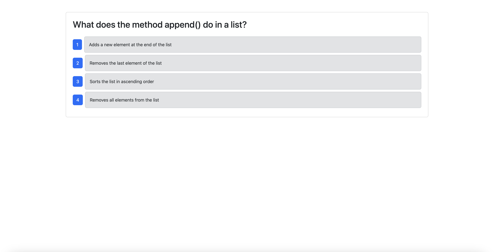
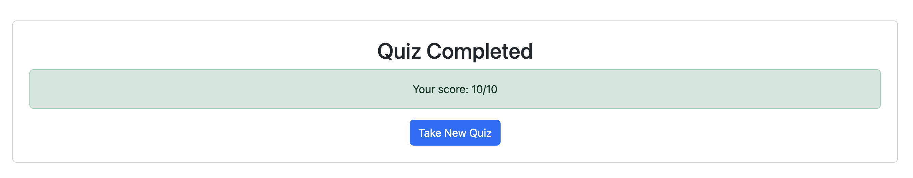

# CI/CD GitHub Actions Implementation


## Description
A CI/CD pipeline implementation using GitHub Actions for a React-based quiz application. The pipeline runs Cypress component tests on Pull Requests to the develop branch and automatically deploys to Render when code is merged from develop to main.

## Features
- Automated Cypress component testing on PR to develop branch
- Automated deployment to Render on merge to main
- GitHub Actions workflow configuration
- Branch protection and workflow rules
- Render deployment hooks integration

## Technologies Used
- GitHub Actions
- Cypress
- React
- TypeScript
- Render
- MongoDB
- Express.js
- Node.js
- Bootstrap

## CI/CD Pipeline Setup

### 1. Branch Structure
- Main branch: Production code
- Develop branch: Integration branch
- Feature branches: Individual features

### 2. GitHub Actions Configuration

#### Cypress Testing Workflow
```yaml
name: Cypress Component Tests

on:
    pull_request:
        branches:
            - develop

jobs:
    cypress-run:
        runs-on: ubuntu-latest
        steps:
            - name: Checkout repository
              uses: actions/checkout@v4

            - name: Install dependencies
              run: npm install

            - name: Run Cypress component tests
              uses: cypress-io/github-action@v6
              with:
                  component: true
                  browser: chrome
                  headless: true
              continue-on-error: false

            - name: Upload Cypress screenshots
              if: always()
              uses: actions/upload-artifact@v4
              with:
                  name: cypress-screenshots
                  path: cypress/screenshots
```

#### Render Deployment Workflow
```yaml
name: Deploy to Render

on:
    pull_request:
        types:
            - closed
        branches:
            - main

jobs:
    deploy:
        if: github.event.pull_request.merged == true
        runs-on: ubuntu-latest
        steps:
            - name: Trigger Render Deployment
              run: |
                  curl -X POST "https://api.render.com/deploy/${{ secrets.RENDER_SERVICE_ID }}?key=${{ secrets.RENDER_SERVICE_KEY }}"
```

### 3. Render Setup
1. Deploy application to Render
2. Disable Auto-Deploy in Render settings
3. Copy Deploy Hook URL
4. Add the following secrets to GitHub repository:
   ```
   RENDER_SERVICE_ID
   RENDER_SERVICE_KEY
   RENDER_API_KEY
   ```

## Local Development Setup
1. Clone the repository
2. Install dependencies:
```bash
npm install
```

3. Create MongoDB database and seed data:
```bash
npm run seed
```

4. Start development server:
```bash
npm run develop
```

## Running Tests
```bash
# Run component tests
npm run test-component

# Run tests with GUI
npm run test-gui
```

## Project Structure
- `.github/workflows/`: CI/CD workflow configurations
- `client/`: React frontend application
- `server/`: Express backend application
- `cypress/`: Test configurations and specs

## Credits
This project was created as part of a coding bootcamp challenge. The implementation follows CI/CD best practices and integrates with modern deployment platforms. I had help from my tutor.

## Questions
For any questions, please contact me:
- GitHub: [JaceG](https://github.com/JaceG)
- Email: [jace.galloway@gmail.com](mailto:jace.galloway@gmail.com)

## Preview



